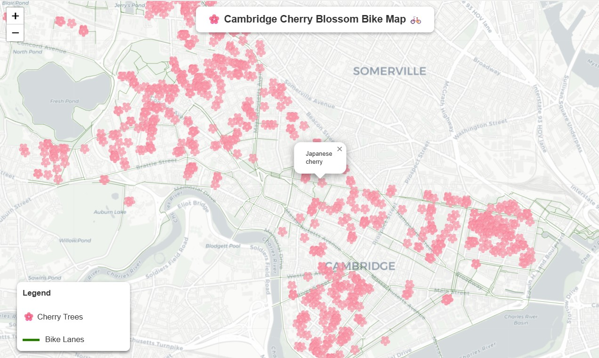

## Cambridge Cherry Blossom Bike Map

 

#### Check out the interactive map: 
https://greciawhite.github.io/cambridge-cherry-tree-bike-map/ 

This project builds on the assignment I completed as part of the Python course taught by the folks at Spatial Thoughts where we learned how to access data via APIs and analyze and visualise it using pandas. 

Check out their online resources and upcoming courses: https://spatialthoughts.com/

#### Data sources:¶
- City of Cambridge Street Trees: https://data.cambridgema.gov/Public-Works/Street-Trees/82zb-7qc9/about_data
- City of Cambrdige bike facilities: https://data.cambridgema.gov/Public-Works/Bike-Facilities/9aey-9g9p/about_data

#### Tools: 
- pandas - data cleaning, filtering and analysis
- folium - creating interactive web map
- requests - querying data from a public API
- Jupyter lab - development environment
- Github Pages - deployment


#### Next steps
Because the tree dataset is so comprehensive, I'd like to keep exploring it and work toward the following future iterations:

- Overlay neighborhood boundaries and calculate cherry tree density based on the area of each neighborhood. 

- Expand the number of tree species to include 1-5 species so that people can choose from a dropdown menu the kinds of trees they are interested in seeing. The locations of the selected trees will populate on the map and the user can curate their bike route based on the tree locations.

- Allow users to enter two addresses and be able to see the number and species of the trees along their route

#### Hope you enjoy the pink blooms this year or next!


```
